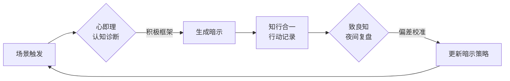

---

### **工具名称**：**「心镜」—— 阳明心学心理暗示实践助手**  
（寓意：以心为镜，观照言行，知行合一）

---

### **核心设计逻辑**  
1. **融合阳明心学三大核心理念**：  
   - **心即理** → 提供认知重塑工具  
   - **知行合一** → 连接暗示与行动  
   - **致良知** → 内置道德校准系统  
2. **四步闭环**：感知场景 → 生成暗示 → 记录行动 → 良知复盘  

---

### **工具形态**  
**跨平台轻量化应用**：  
- **移动端APP**（主场景）+ **微信小程序**（快捷入口）+ **实体感应手环**（振动触发提醒）  
- **界面风格**：水墨动态设计，操作如「磨镜」般简洁（呼应阳明“心如明镜”比喻）

---

### **六大核心功能**  

#### **1. 情境感知智能暗示库**  
- **AI场景识别**：  
  - 通过用户输入的关键词/手环生物数据（如心率异常），自动匹配阳明心学经典暗示语  
  - *示例*：  
    - 检测到长时间静坐 → 推送“起身如竹，节节贯通”（结合“事上磨练”思想）  
    - 识别争吵语音 → 振动提示“且停三分，观人如己”（激活“万物一体”观）  

- **自定义暗示工坊**：  
  - 提供“阳明语法”模板：  
    `[场景]+[心学原理]+[行为指令]`  
    *如：“当____时（场景），须知____（心即理），故应____（知行合一）”*  

---

#### **2. 心流日记（区块链存证版）**  
- **三重记录体系**：  
  | **层级** | **记录方式**                | **阳明心学对应**         |  
  |----------|-----------------------------|--------------------------|  
  | 表层     | 语音速记当日事件            | “事上磨练”实证           |  
  | 中层     | 选择应用的暗示语及效果评分  | “知行合一”反馈环         |  
  | 深层     | 手写笔迹记录良知感悟        | “致良知”加密存证（可生成NFT作为数字心镜） |  

---

#### **3. 冲突化解模拟器**  
- **全息情景训练**：  
  - 预设七大矛盾场景（职场/家庭/社交等），用户佩戴VR设备进入三维空间  
  - *案例*：  
    - 虚拟上司指责时，眼前浮现“他人之言如镜，照见精进处”并需语音回应  
    - 系统根据微表情/应答速度生成“良知偏离度”报告  

---

#### **4. 心学能量环（可视化系统）**  
- **数据仪表盘**：  
  - 将用户行为转化为三种心学能量：  
    - **澄明值**（正念暗示使用频率）  
    - **躬行力**（暗示后实际行动次数）  
    - **良知度**（道德选择一致性）  
  - 能量满格可解锁王阳明语音课程包  

---

#### **5. 共修社区——「千圣同心」**  
- **匿名互助机制**：  
  - 用户以阳明经典语录为代号（如用户“龙场悟道1997”）  
  - 发布困境后，系统用AI提炼核心矛盾，其他用户用暗示语“投石”相助  
  - 最佳方案将被收入《当代传习录》数字文集  

---

#### **6. 晨昏定省机器人**  
- **卯酉二时推送**：  
  - **晨间卯时**：  
    - 智能生成当日“心即理”主题（如“今日心镜：减得一分人欲，复得一分天理”）  
    - 结合日程安排推荐3句行动暗示  
  - **晚间酉时**：  
    - 语音问答复盘：“今日可有一事，知行未能合一？”  
    - 生成“格物日记”并同步至云端心学图谱  

---

### **创新技术整合**  
| **技术**         | **心学应用场景**                     |  
|------------------|--------------------------------------|  
| 情感计算         | 通过摄像头分析微表情，提示“不动心”训练 |  
| 脑机接口（Beta） | 监测杂念频率，触发“克己”振动提醒     |  
| 数字孪生         | 创建用户虚拟分身，模拟“十年后观今日” |  

---

### **实体配套工具**  
- **心学罗盘手环**：  
  - 表盘刻“知行合一”篆字，每小时轻微振动并显示随机暗示语  
  - 紧急长按触发“致良知三问”呼吸引导（“此心是否正？此知是否真？此行是否诚？”）  

- **传习卡牌**：  
  - 56张可拼接卡片，每张印有场景插画与空白暗示框  
  - 扫码上传自定义卡牌至数字博物馆，全球用户共筑“心学暗示宇宙”  

---

### **商业模式**  
- **基础功能免费**：暗示库+基础记录  
- **进阶服务**：  
  - 企业定制版（将“致良知”融入组织文化）  
  - 家庭教育版（亲子共修“事上磨练”课程）  
  - 政企采购“廉洁自律”特别模块（基于“破心中贼”思想）  

---

### **阳明心学底层架构**  

---

### **价值主张**  
**让500年前的心学智慧，成为当代人的“心理操作系统”**  
—— 每一次暗示，都是对内心圣人的唤醒；每一次行动，皆成修身齐家的刻度。

 我想开发一个以上面初步需求的游戏app产品，现在需要输出高保真的原型图，请通过以下方式帮我完成所有界面的原型设计，并确保这些原型界面可以直接用于开发：1、用户体验分析：先分析这个 App 的主要功能和用户需求，确定核心交互逻辑。2、产品界面规划：作为产品经理，定义关键界面，确保信息架构合理。3、高保真 UI 设计：作为 UI 设计师，设计贴近真实 iOS/Android 设计规范的界面，使用现代化的 UI 元素，使其具有良好的视觉体验。4、HTML 原型实现：使用 HTML + Tailwind CSS（或 Framework7 ）生成所有原型界面，并使用 FontAwesome（或其他开源 UI 组件）让界面更加精美、接近真实的 App 设计。拆分代码文件，保持结构清晰：5、每个界面应作为独立的 HTML 文件存放，例如 home.html、profile.html、settings.html 等。- index.html 作为主入口，不直接写入所有界面的 HTML 代码，而是使用 iframe 的方式嵌入这些 HTML 片段，并将所有页面直接平铺展示在 index 页面中，而不是跳转链接。- 真实感增强： -动画库使用 GASP - 界面尺寸应模拟 iPhone 15 Pro，并让界面圆角化，使其更像真实的手机界面。 - 使用真实的 UI 图片，而非占位符图片（可从 Unsplash、Pexels、Apple 官方 UI 资源中选择）。 - 添加顶部状态栏（模拟 iOS 状态栏），并包含 App 导航栏（类似 iOS 底部 Tab Bar）。请按照以上要求生成完整的 HTML 代码，并确保其可用于实际开发。设计风格使用game-ui-design-style.md中的12. Game UI（游戏界面）魔幻风格
